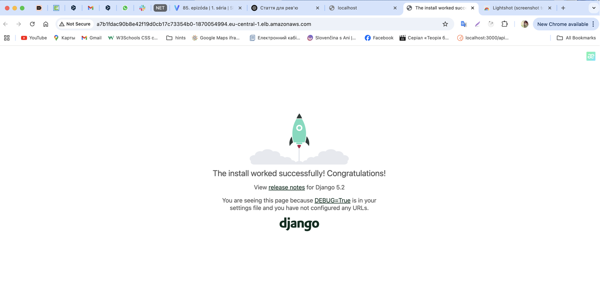

#My own microservice project 

This is a repository for a training project within the DevOps CI/CD course.


Project structure: 

```
lesson-5/
│
├── main.tf                  # Головний файл для підключення модулів
├── backend.tf               # Налаштування бекенду для стейтів (S3 + DynamoDB)
├── outputs.tf               # Загальне виведення ресурсів
│
├── modules/                 # Каталог з усіма модулями
│   │
│   ├── s3-backend/          # Модуль для S3 та DynamoDB
│   │   ├── s3.tf            # Створення S3-бакета
│   │   ├── dynamodb.tf      # Створення DynamoDB
│   │   ├── variables.tf     # Змінні для S3
│   │   └── outputs.tf       # Виведення інформації про S3 та DynamoDB
│   │
│   ├── vpc/                 # Модуль для VPC
│   │   ├── vpc.tf           # Створення VPC, підмереж, Internet Gateway
│   │   ├── routes.tf        # Налаштування маршрутизації
│   │   ├── variables.tf     # Змінні для VPC
│   │   └── outputs.tf       # Виведення інформації про VPC
│   │
│   └── ecr/                 # Модуль для ECR
│       ├── ecr.tf           # Створення ECR репозиторію
│       ├── variables.tf     # Змінні для ECR
│       └── outputs.tf       # Виведення URL репозиторію ECR
│
└── README.md                # Документація проєкту

```

Command:

terraform init

terraform plan

terraform apply

terraform destroy


Modules:

s3-backend - Цей модуль потрібен для  зберігання стан (state) інфраструктури в AWS S3 замість локального файлу та блокування змін до кінця роботи процеса

vpc - створення приватних та публічних підмереж, шлюза та роутінг таблиця

ecr - репозиторій для контейнерів

# Django App Deployment on AWS EKS

## Має бути завантажено:

- AWS account with sufficient permissions
- AWS CLI configured (`aws configure`)
- Docker installed and running
- kubectl installed
- Helm installed
- Terraform installed

## 1. Збірка та завантаження Docker Image to ECR

1. **Аунтетіфікація Docker в ECR:**
   ```sh
   aws ecr get-login-password --region <your-region> | docker login --username AWS --password-stdin <your-account-id>.dkr.ecr.<your-region>.amazonaws.com
   ```

2. **Створення Docker image:**
   ```sh
   docker build -t django-app .
   ```

3. **Додавання тега до image:**
   ```sh
   docker tag django-app:latest <your-account-id>.dkr.ecr.<your-region>.amazonaws.com/lesson-5-ecr-nat:latest
   ```

4. **Завантаження image в ECR:**
   ```sh
   docker push <your-account-id>.dkr.ecr.<your-region>.amazonaws.com/lesson-5-ecr-nat:latest
   ```


## 2. Конфігурація kubectl

1. **Оновлення kubeconfig в EKS кластері:**
   ```sh
   aws eks --region <your-region> update-kubeconfig --name <your-cluster-name>
   ```

2. **Перевірка доступу к кластеру:**
   ```sh
   kubectl get nodes
   ```

## 3. Deploy Django App за допомогою Helm

1. **Перейти в Helm chart directory:**
   ```sh
   cd charts/django-app
   ```

2. **Обновити `values.yaml`, додати ECR image repository та tag.**

3. **Зробити інстоляцію chart:**
   ```sh
   helm install nat .
   ```

4. **Отримати external URL:**
   ```sh
   kubectl get svc
   ```
   - Look for the `EXTERNAL-IP` of the `nat-django` service.

5. **Відкрити Django app за допомогую броузера:**
   ```
   http://<external-elb-dns>
   ```




## 5. Очищення ресурсів

To remove all resources:
```sh
helm uninstall nat
terraform destroy
```


