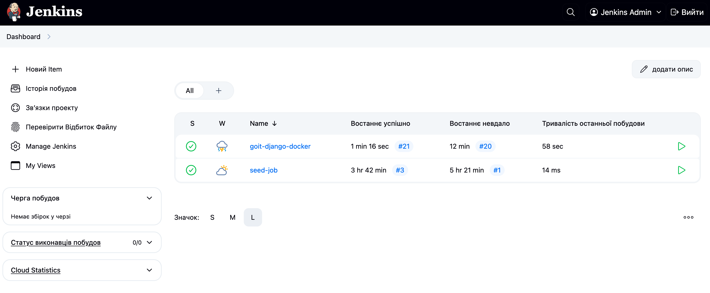
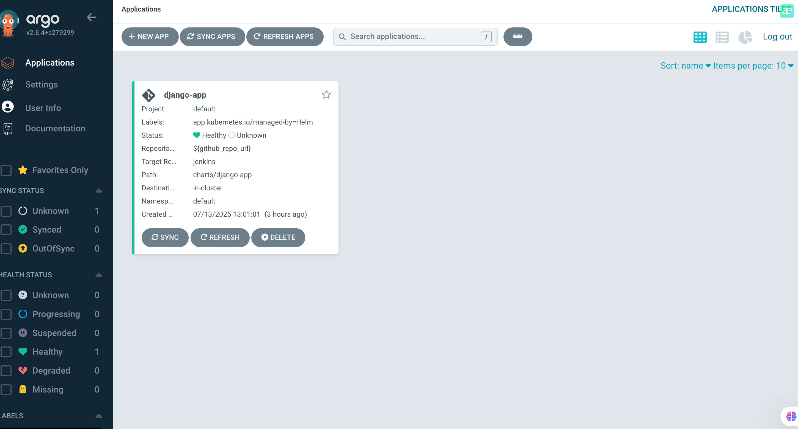
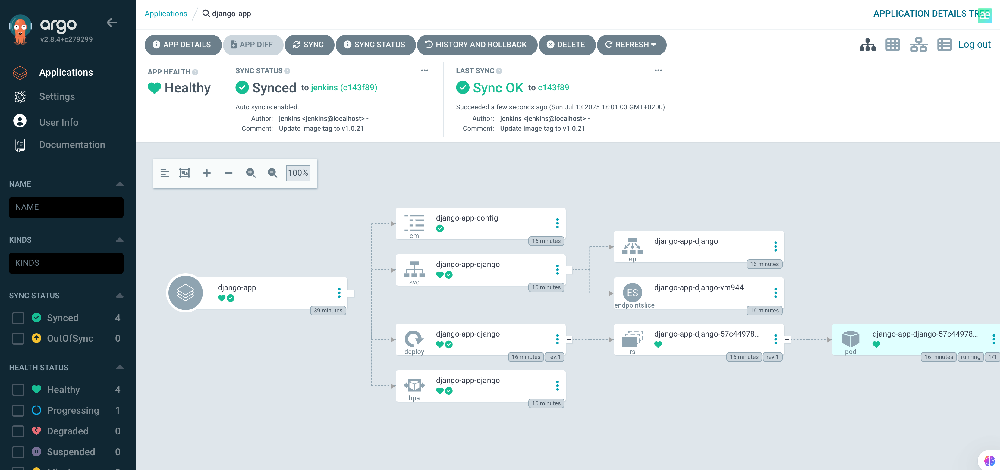
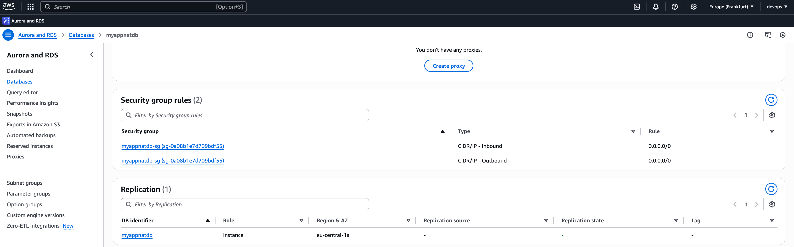
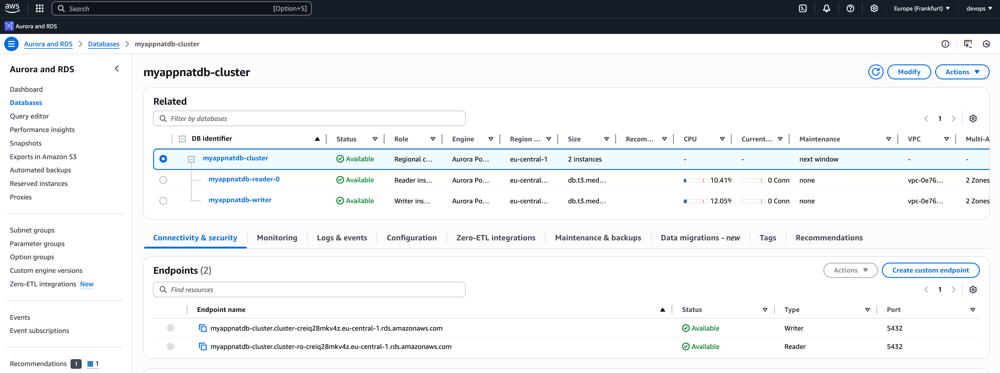
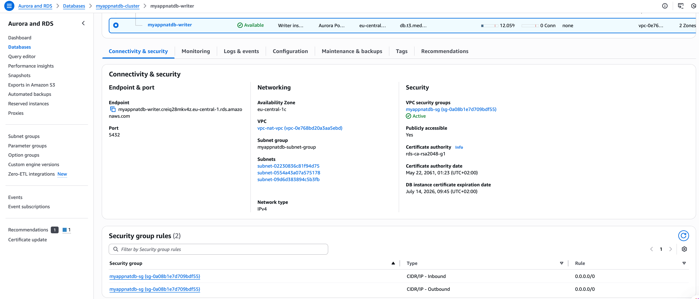
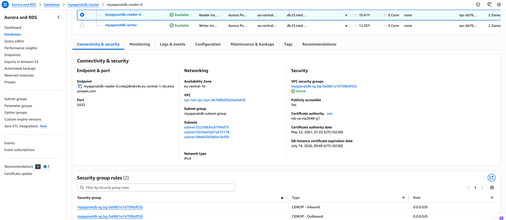
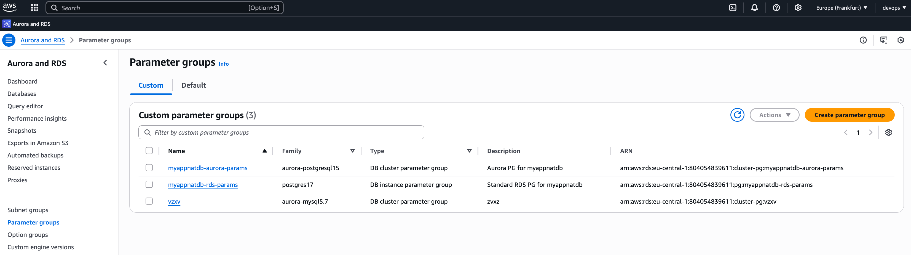

#My own microservice project 

This is a repository for a training project within the DevOps CI/CD course.


Project structure: 

```
Progect/
│
├── main.tf                  # Головний файл для підключення модулів
├── backend.tf               # Налаштування бекенду для стейтів (S3 + DynamoDB
├── outputs.tf               # Загальні виводи ресурсів
│
├── modules/                 # Каталог з усіма модулями
│   ├── s3-backend/          # Модуль для S3 та DynamoDB
│   │   ├── s3.tf            # Створення S3-бакета
│   │   ├── dynamodb.tf      # Створення DynamoDB
│   │   ├── variables.tf     # Змінні для S3
│   │   └── outputs.tf       # Виведення інформації про S3 та DynamoDB
│   │
│   ├── vpc/                 # Модуль для VPC
│   │   ├── vpc.tf           # Створення VPC, підмереж, Internet Gateway
│   │   ├── routes.tf        # Налаштування маршрутизації
│   │   ├── variables.tf     # Змінні для VPC
│   │   └── outputs.tf  
│   ├── ecr/                 # Модуль для ECR
│   │   ├── ecr.tf           # Створення ECR репозиторію
│   │   ├── variables.tf     # Змінні для ECR
│   │   └── outputs.tf       # Виведення URL репозиторію
│   │
│   ├── eks/                      # Модуль для Kubernetes кластера
│   │   ├── eks.tf                # Створення кластера
│   │   ├── aws_ebs_csi_driver.tf # Встановлення плагіну csi drive
│   │   ├── variables.tf     # Змінні для EKS
│   │   └── outputs.tf       # Виведення інформації про кластер
│   │
│   ├── rds/                 # Модуль для RDS
│   │   ├── rds.tf           # Створення RDS бази даних  
│   │   ├── aurora.tf        # Створення aurora кластера бази даних  
│   │   ├── shared.tf        # Спільні ресурси  
│   │   ├── variables.tf     # Змінні (ресурси, креденшели, values)
│   │   └── outputs.tf  
│   │ 
│   ├── jenkins/             # Модуль для Helm-установки Jenkins
│   │   ├── jenkins.tf       # Helm release для Jenkins
│   │   ├── variables.tf     # Змінні (ресурси, креденшели, values)
│   │   ├── providers.tf     # Оголошення провайдерів
│   │   ├── values.yaml      # Конфігурація jenkins
│   │   └── outputs.tf       # Виводи (URL, пароль адміністратора)
│   │ 
│   └── argo_cd/             # Mодуль для Helm-установки Argo CD
│       ├── argo_cd.tf       # Helm release для Argo CD
│       ├── variables.tf     # Змінні (версія чарта, namespace, repo URL тощо)
│       ├── providers.tf     # Kubernetes+Helm.  переносимо з модуля jenkins
│       ├── values.yaml      # Кастомна конфігурація Argo CD
│       ├── outputs.tf       # Виводи (hostname, initial admin password)
│		    └──charts/                  # Helm-чарт для створення app'ів
│ 	 	    ├── Chart.yaml
│	  	    ├── values.yaml          # Список applications, repositories
│			    └── templates/
│		        ├── application.yaml
│		        └── repository.yaml
├── charts/
│   └── django-app/
│       ├── templates/
│       │   ├── deployment.yaml
│       │   ├── service.yaml
│       │   ├── configmap.yaml
│       │   └── hpa.yaml
│       ├── Chart.yaml
│       └── values.yaml     # ConfigMap зі змінними середовища


```

Command:

terraform init

terraform plan

terraform apply

terraform destroy


Modules:

s3-backend - Цей модуль потрібен для  зберігання стан (state) інфраструктури в AWS S3 замість локального файлу та блокування змін до кінця роботи процеса

vpc - створення приватних та публічних підмереж, шлюза та роутінг таблиця

ecr - репозиторій для контейнерів

# Django App Deployment on AWS EKS

## Має бути завантажено:

- AWS account with sufficient permissions
- AWS CLI configured (`aws configure`)
- Docker installed and running
- kubectl installed
- Helm installed
- Terraform installed

## 1. Збірка та завантаження Docker Image to ECR

1. **Аунтетіфікація Docker в ECR:**
   ```sh
   aws ecr get-login-password --region <your-region> | docker login --username AWS --password-stdin <your-account-id>.dkr.ecr.<your-region>.amazonaws.com
   ```

2. **Створення Docker image:**
   ```sh
   docker build -t django-app .
   ```

3. **Додавання тега до image:**
   ```sh
   docker tag django-app:latest <your-account-id>.dkr.ecr.<your-region>.amazonaws.com/lesson-5-ecr-nat:latest
   ```

4. **Завантаження image в ECR:**
   ```sh
   docker push <your-account-id>.dkr.ecr.<your-region>.amazonaws.com/lesson-5-ecr-nat:latest
   ```


## 2. Конфігурація kubectl

1. **Оновлення kubeconfig в EKS кластері:**
   ```sh
   aws eks --region <your-region> update-kubeconfig --name <your-cluster-name>
   ```

2. **Перевірка доступу к кластеру:**
   ```sh
   kubectl get nodes
   ```

## 3. Deploy Django App за допомогою Helm

1. **Перейти в Helm chart directory:**
   ```sh
   cd charts/django-app
   ```

2. **Обновити `values.yaml`, додати ECR image repository та tag.**

3. **Зробити інстоляцію chart:**
   ```sh
   helm install nat .
   ```

4. **Отримати external URL:**
   ```sh
   kubectl get svc
   ```
   - Look for the `EXTERNAL-IP` of the `nat-django` service.

5. **Відкрити Django app за допомогую броузера:**
   ```
   http://<external-elb-dns>
   ```


## 6. **Jenkins**


## 7. **Argo_cd**




## 8. **DB**

RDB





Aurora







Parameter groups




# Terraform RDS Module

Універсальний модуль для створення AWS RDS або Aurora кластеру з мінімальними змінами змінних.


##  Підтримка

- Звичайна RDS інстанція (PostgreSQL, MySQL тощо)

- Aurora Cluster (PostgreSQL-compatible, MySQL-compatible)

- Автоматичне створення:

  - DB Subnet Group

  - Security Group

  - Parameter Group

```
| Назва                           | Тип         | Обов’язкова    | Опис                                                             |
| ------------------------------- | ----------- | -------------- | ---------------------------------------------------------------- |
| `name`                          | string      | ✅              | Ідентифікатор (ім'я) інстансу або кластера                       |
| `use_aurora`                    | bool        | ✅              | Якщо `true`, створюється Aurora Cluster                          |
| `engine`                        | string      | ✅              | Тип БД: `postgres`, `mysql`, `aurora-postgresql`, `aurora-mysql` |
| `engine_version`                | string      | ✅              | Версія СУБД (наприклад, `15.3`)                                  |
| `instance_class`                | string      | ✅              | Клас EC2 інстансу (наприклад, `db.t3.medium`)                    |
| `allocated_storage`             | number      | ❌              | Розмір диску (тільки для звичайного RDS)                         |
| `aurora_instance_count`         | number      | ❌              | Кількість інстансів у кластері Aurora                            |
| `db_name`                       | string      | ✅              | Назва БД (має починатися з літери, без спецсимволів)             |
| `username`                      | string      | ✅              | Ім’я користувача для доступу                                     |
| `password`                      | string      | ✅              | Пароль користувача                                               |
| `multi_az`                      | bool        | ❌              | Якщо `true`, створюється Multi-AZ RDS                            |
| `publicly_accessible`           | bool        | ❌              | Якщо `true`, інстанс буде доступний публічно                     |
| `backup_retention_period`       | number      | ❌              | Кількість днів збереження бекапів                                |
| `parameter_group_family_rds`    | string      | ✅ (для RDS)    | Наприклад, `postgres15`                                          |
| `parameter_group_family_aurora` | string      | ✅ (для Aurora) | Наприклад, `aurora-postgresql15`                                 |
| `parameters`                    | map(string) | ❌              | Додаткові параметри БД                                           |
| `tags`                          | map(string) | ❌              | Теги ресурсу                                                     |

```

## Як змінити тип БД, engine, клас інстансу тощо

```

| Що змінити                    | Як                                                  |
| ----------------------------- | --------------------------------------------------- |
| 🔁 Звичайна RDS ↔ Aurora      | Змінити `use_aurora` на `true/false`                |
| 🔁 Engine (PostgreSQL, MySQL) | Змінити `engine` та `engine_version`                |
| 🔁 Клас інстансу              | Змінити `instance_class` (наприклад, `db.t3.micro`) |
| 🔁 Назву бази                 | Оновити `db_name`                                   |
| 🛠️ Параметри БД               | Додати до `parameters` (map, ключ-значення)         |

```

## 9. Очищення ресурсів

To remove all resources:
```sh
helm uninstall nat
terraform destroy
```


